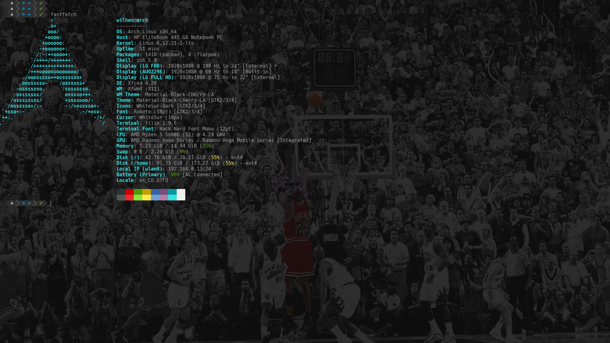
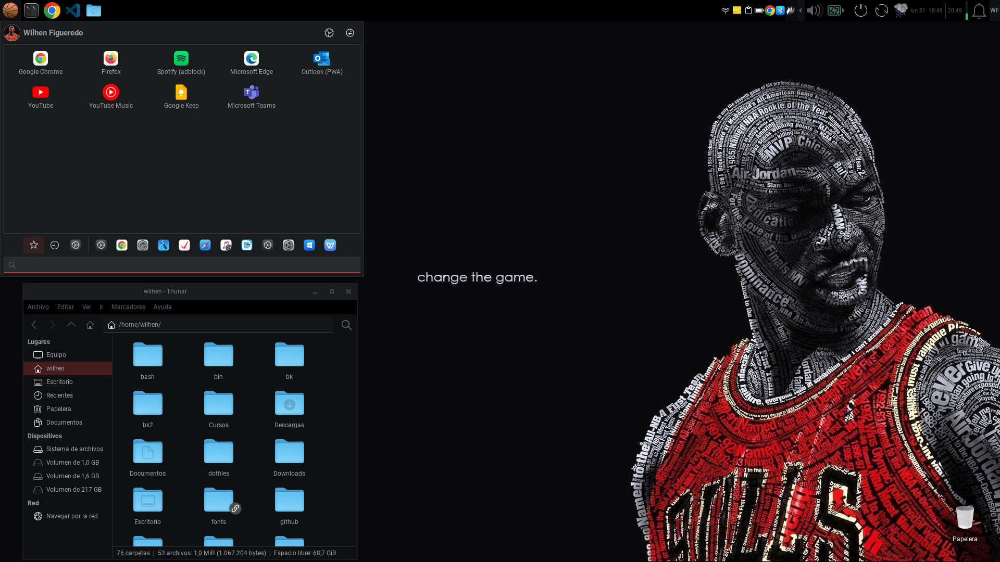

# 🚀 Dotfiles de Linux - Restauración y Configuración

Configuraciones de Linux.

## 📌 Pre-requisitos

Antes de restaurar los dotfiles, asegúrate de instalar las siguientes herramientas:

### 🐧 Linux:
1. **Zsh** (Shell alternativa a Bash) con oh-my-zsh
   ```sh
   sh -c "$(wget https://raw.githubusercontent.com/ohmyzsh/ohmyzsh/master/tools/install.sh -O -)"
   ```
2. **Powerlevel10k** (Tema para Zsh)
   ```sh
   git clone --depth=1 https://github.com/romkatv/powerlevel10k.git ~/.local/share/powerlevel10k
   echo 'source ~/.local/share/powerlevel10k/powerlevel10k.zsh-theme' >> ~/.zshrc
   ```
3. **Conky** (Monitor del sistema)
   ```sh
   sudo pacman -S conky  # Para Arch Linux
   sudo apt install conky # Para Debian/Ubuntu
   ```
4. **Git** (Para clonar el repositorio de dotfiles)
   ```sh
   sudo pacman -S git  # Para Arch Linux
   sudo apt install git # Para Debian/Ubuntu
   ```
   ---
      
## 📂 Restauración de Dotfiles

1️⃣ **Clonar el repositorio**:
```sh
git clone https://github.com/wilhen199/dotfiles/tree/linux ~/dotfiles
```

2️⃣ **Crear enlaces simbólicos** para que las configuraciones sean reconocidas por el sistema:
```sh
ln -s ~/dotfiles/.zshrc ~/.zshrc
ln -s ~/dotfiles/.p10k.zsh ~/.p10k.zsh
ln -s ~/dotfiles/.config/rofi ~/.config/rofi
ln -s ~/dotfiles/.config/xfce4 ~/.config/xfce4
ln -s ~/dotfiles/.config/xfce4 ~/.config/thunar
```

3️⃣ **Restaurar la configuración de Tilix** (si usas este terminal):
```sh
dconf load /com/gexperts/Tilix/ < ~/dotfiles/tilix/tilix_backup.conf
```

4️⃣ **Aplicar cambiosm en la terminal (ZSH)**:
```sh
source ~/.zshrc
```
---

## 🖼 Capturas de Pantalla

Aquí hay una vista previa de cómo debería verse la configuración después de la restauración:






---

## 📢 Notas Adicionales
- Si algo no funciona correctamente, verifica que los paquetes necesarios estén instalados.
- Para actualizar los dotfiles en el futuro:
  ```sh
  cd ~/dotfiles
  git pull origin main
  ```
✍️ **Wilhen | [GitHub](https://github.com/wilhen199) | [LinkedIn](https://www.linkedin.com/in/wilhen-figueredo/)**
