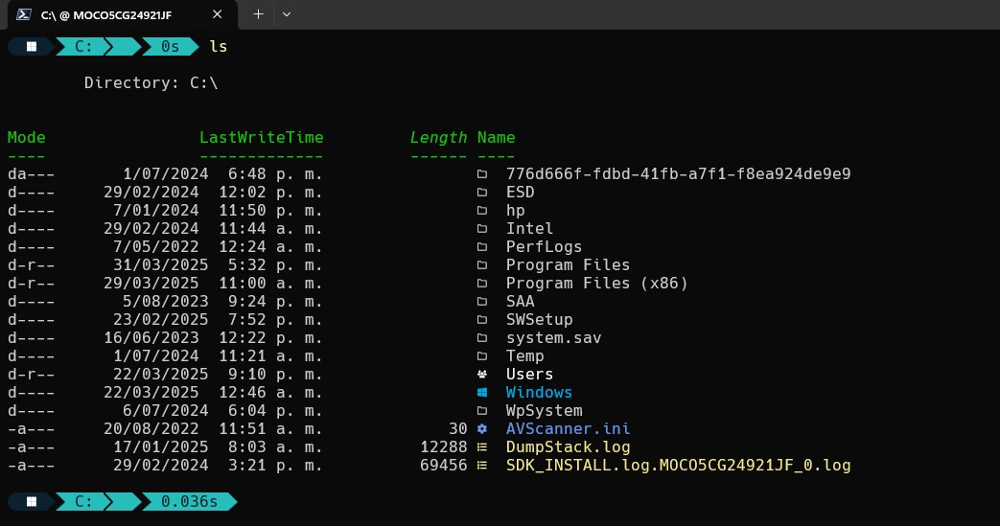

# 🛠️ Mis Dotfiles

Este repositorio contiene mis configuraciones personalizadas para **Linux** y **Windows**.

📂 **Ramas disponibles:**
- 🐧 **[Linux](https://github.com/wilhen199/dotfiles/tree/linux)** → Configuraciones para Arch Linux + XFCE + ZSH + TILIX + CONKY + ROFI
- 🖥️ **[Windows](https://github.com/wilhen199/dotfiles/tree/windows)** → Configuraciones para Windows Terminal y PowerShell

---

## 📸 Capturas de pantalla

| Linux | Windows |
|-------|---------|
|  |  |
|  |
|  |
|  |


---

## 📥 Cómo usar

### 🔹 En Linux
```bash
git clone -b linux https://github.com/wilhen199/dotfiles.git
```

### 🔹 En Windows (PowerShell)
```powershell
git clone -b windows https://github.com/wilhen199/dotfiles.git
```
✍️ **Wilhen | [GitHub](https://github.com/wilhen199) | [LinkedIn](https://www.linkedin.com/in/wilhen-figueredo/)**


